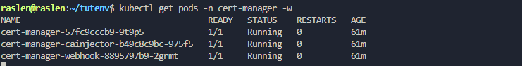
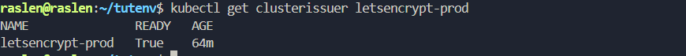
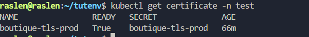
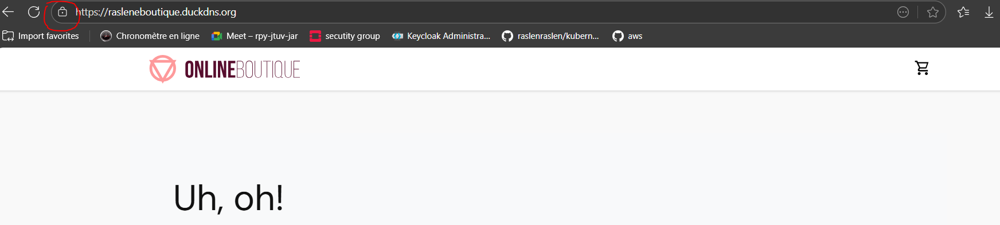

# 🚀 Guide Complet : Déploiement et Sécurisation d'une Application sur Azure AKS (Nginx Ingress & Let's Encrypt)

Ce guide pas à pas détaille le processus complet pour déployer une application sur un cluster Azure Kubernetes Service (AKS), l'exposer publiquement via un Nginx Ingress Controller, et sécuriser l'accès avec un certificat TLS/SSL de production de Let's Encrypt.

---

### **Pré-requis Indispensables (Configuration Initiale)**

Pour une configuration complète de votre environnement, veuillez suivre les étapes et guides détaillés ci-dessous :

1.  **Installation et Connexion à Azure CLI :**
    *   Si Azure CLI n'est pas déjà installé sur votre machine :
        ```bash
        sudo apt update && sudo apt install -y ca-certificates curl apt-transport-https lsb-release gnupg
        curl -sL https://packages.microsoft.com/keys/microsoft.asc | sudo gpg --dearmor -o /usr/share/keyrings/microsoft.gpg
        AZ_REPO=$(lsb_release -cs)
        echo "deb [arch=amd64 signed-by=/usr/share/keyrings/microsoft.gpg] https://packages.microsoft.com/repos/azure-cli/ $AZ_REPO main" | sudo tee /etc/apt/sources.list.d/azure-cli.list
        sudo apt update
        sudo apt install -y azure-cli
        ```
    *   Connectez-vous à votre compte Azure :
        ```bash
        az login
        ```
    *   Vérifiez l'installation :
        ```bash
        az version
        ```

2.  **Cluster Azure AKS fonctionnel :**
    *   **Création :** Référez-vous à mes fichiers de configuration Terraform dans `~/tutenv/cluster-AKS-terraform/` (incluant `main.tf`, `outputs.tf`) pour le déploiement d'un cluster AKS vierge.
    *   **Connexion `kubectl` :** Assurez-vous que `kubectl` est configuré et connecté à votre cluster AKS (`kubectl config use-context <nom-de-votre-aks>`). Pour récupérer les identifiants :
        ```bash
        az aks get-credentials --resource-group <votre-resource-group-aks> --name <votre-nom-aks> --overwrite-existing
        ```

3.  **Nginx Ingress Controller et Nom de Domaine Public (Configuration Avancée) :**
    *   **Configuration Complète :** Référez-vous à mon guide dédié `~/tutenv/ingress/steps-dans-cloud-azure.md`. Ce guide couvre :
        *   L'installation du Nginx Ingress Controller sur AKS.
        *   L'obtention d'une IP publique Azure Load Balancer.
        *   La configuration de votre nom de domaine (ex: `rasleneboutique.duckdns.org`).
        *   L'ajustement des règles du Network Security Group (NSG) pour autoriser le trafic HTTP (port 80) et HTTPS (port 443).
    *   **Avant de poursuivre ce guide, assurez-vous que toutes ces étapes sont complétées et que votre application est accessible en HTTP via votre nom de domaine public.**

---


### **1. Installation de Cert-Manager sur AKS** 🔒

Maintenant que l'infrastructure réseau et l'exposition HTTP de votre application sont en place (selon le guide `steps-dans-cloud-azure.md`), nous allons installer Cert-Manager. Cet outil va automatiser l'obtention et la gestion des certificats TLS/SSL de production.

1.  **Création du Namespace `cert-manager` :**
    ```bash
    kubectl create namespace cert-manager
    ```

2.  **Installation des Custom Resource Definitions (CRDs) :**
    ```bash
    kubectl apply -f https://github.com/cert-manager/cert-manager/releases/download/v1.12.0/cert-manager.crds.yaml
    ```
    > **Pourquoi ?** Les CRDs (`ClusterIssuer`, `Certificate` etc.) sont des types d'objets Kubernetes personnalisés introduits par Cert-Manager. Le cluster doit les connaître avant de pouvoir les utiliser.

3.  **Installation des composants principaux de Cert-Manager :**
    ```bash
    kubectl apply -f https://github.com/cert-manager/cert-manager/releases/download/v1.12.0/cert-manager.yaml
    ```

4.  **Vérification du Déploiement :**
    ```bash
    kubectl get pods -n cert-manager -w
    # Attendez que les pods "cert-manager-XXXXX", "cert-manager-cainjector-XXXXX", "cert-manager-webhook-XXXXX" soient "Running" et "READY 1/1".
    ```
    > **Validation :** À ce stade, Cert-Manager est entièrement opérationnel sur votre cluster.

---




### **2. Configuration du `ClusterIssuer` pour Let's Encrypt** 🔐

Le `ClusterIssuer` est la ressource Cert-Manager qui définit la "recette" pour obtenir les certificats. Nous allons le configurer pour interagir avec Let's Encrypt en utilisant la méthode de validation `HTTP-01`.

1.  **Création du fichier `letsencrypt-prod-clusterissuer.yaml` :**
    *   Assurez-vous d'être dans un dossier de configuration (ex: `~/tutenv/cert-manager-config`).

    ```bash
    mkdir -p ~/tutenv/cert-manager-config
    cd ~/tutenv/cert-manager-config
    vi letsencrypt-prod-clusterissuer.yaml
    ```
    Collez le contenu suivant. **Remplacez `ton_email@example.com` par une adresse e-mail VALIDE !**

    ```yaml
    apiVersion: cert-manager.io/v1
    kind: ClusterIssuer
    metadata:
      name: letsencrypt-prod
      annotations:
       
        acme.cert-manager.io/disable-challenge-http01-self-check: "true" 
    spec:
      acme:
        server: https://acme-v02.api.letsencrypt.org/directory
        email: ton_email@example.com 
        privateKeySecretRef:
          name: letsencrypt-prod-account-key
        solvers:
        - http01:
            ingress:
              class: nginx 
    ```
    > **Pourquoi ?** Le `ClusterIssuer` est une ressource globale (`Cluster`) qui permet aux Ingress de n'importe quel namespace de demander un certificat Let's Encrypt. L'annotation `disable-challenge-http01-self-check` est une correction courante pour les problèmes de routage interne sur AKS/Cloud qui empêchent Cert-Manager de vérifier sa propre validation.

2.  **Application du `ClusterIssuer` :**
    ```bash
    kubectl apply -f letsencrypt-prod-clusterissuer.yaml
    ```

3.  **Vérification du statut du `ClusterIssuer` :**
    ```bash
    kubectl get clusterissuer letsencrypt-prod 
    # La section "status.conditions" doit contenir "Ready: True".
    ```
    > **Validation :** Le `ClusterIssuer` est correctement configuré et prêt à interagir avec Let's Encrypt.

---




### **3. Configuration de l'Ingress et Validation Finale** 🔒

Nous allons maintenant modifier l'objet Ingress de votre application pour qu'il demande un certificat à Cert-Manager et active le HTTPS.

1.  **Modification du fichier Ingress de votre application :**
 

    ```bash
    cd ~/tutenv/app-de-test-2
    vi boutique-azure-cert.yaml 
    ```
    Modifiez-le pour qu'il inclue les annotations Cert-Manager et la section `tls`.

    ```yaml
    apiVersion: networking.k8s.io/v1
    kind: Ingress
    metadata:
      name: boutique-ingress
      namespace: test
      annotations:
        cert-manager.io/cluster-issuer: letsencrypt-prod 
       
        nginx.ingress.kubernetes.io/force-ssl-redirect: "true" 
    spec:
      ingressClassName: nginx 
      tls:
      - hosts:
        - rasleneboutique.duckdns.org # ⬅️ Votre nom de domaine public (DuckDNS)
        secretName: boutique-tls-prod # ⬅️ Nom du Secret où Cert-Manager stockera le certificat
      rules:
      - host: rasleneboutique.duckdns.org # ⬅️ Votre nom de domaine public (DuckDNS)
        http:
          paths:
          - path: / 
            pathType: Prefix
            backend:
              service:
                name: online-boutique-frontend-service
                port:
                  number: 80 
    ```
    

2.  **Appliquer les modifications à l'Ingress :**
    ```bash
    kubectl apply -f boutique-azure-cert.yaml -n test
    ```

3.  **Surveillance du Processus de Certificat :**
    *   Cert-Manager va maintenant détecter la demande. Surveillez le statut du `Certificate` :
        ```bash
        kubectl get certificate -n test -w
        
        ```
        > **Validation :** "READY: True" signifie que le certificat a été obtenu avec succès de Let's Encrypt et est stocké dans le Secret.




4.  **Forçage du Rechargement de l'Ingress Controller :**
    *   Pour s'assurer que Nginx prend en compte le nouveau certificat et la règle de redirection HTTPS :
        ```bash
        kubectl delete pod -n ingress-nginx -l app.kubernetes.io/component=controller
        # Laissez le nouveau pod démarrer.
        ```

5.  **Test Final de l Sécurisation HTTPS :**
     
    *   Accédez à votre application via HTTPS : **`https://rasleneboutique.duckdns.org/`**

    *   **Résultat Attendu :**
        *   Vous devriez voir le **cadenas fermé** dans la barre d'adresse ! 🔒
        *   **AUCUN avertissement de sécurité ou message "Not secure" !**
        *   Votre application est désormais accessible de manière entièrement sécurisée et reconnue par votre navigateur.

---




