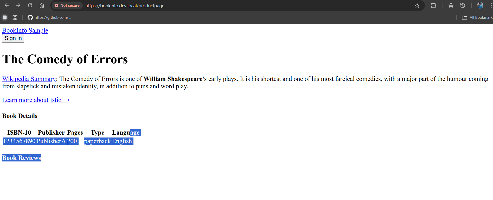

#  Partie 1 : Création et Utilisation d'un Certificat SSL/TLS Auto-Signé (pour le Test Local)

__prerequis__

Cluster Kubernetes opérationnel, MetalLB configuré, Nginx Ingress Controller déployé (exposé via LoadBalancer).  
Application Bookinfo déployée dans le namespace default.  
Un nom de domaine de test configuré dans votre fichier hosts (ex: bookinfo.kube.local pointant vers l'EXTERNAL-IP de votre Ingress Controller).  
L'Ingress bookinfo-ingress est configuré (sans TLS pour le moment) pour ce domaine et pointe vers /productpage.  

__Objectif__

Comprendre et mettre en pratique le chiffrement HTTPS avec un certificat auto-signé.

# Étape 1 : Préparer un dossier de travail et définir les informations du certificat

Pour générer notre certificat, nous allons utiliser l'outil openssl.
Créer un dossier pour les certificats :
````
mkdir -p ~/tutenv/certs
cd ~/tutenv/certs`
````
Définir le nom de domaine (Hostname) pour le certificat :  
Ce doit être le nom de domaine que tu utilises dans ton fichier hosts et ton Ingress.  
````

export DOMAIN_NAME="bookinfo.kube.local"
# Remplace "bookinfo.kube.local" par le nom de domaine que tu as configuré dans ton Ingress et ton fichier hosts.
````
__Créer le fichier de configuration OpenSSL (san.cnf) pour le SAN :__

````
vi san.cnf
````

Colle le contenu suivant, en remplaçant bookinfo.kube.local par la valeur réelle de ton $DOMAIN_NAME :

````
[ req ]
default_bits = 2048
prompt = no
default_md = sha256
req_extensions = req_ext
distinguished_name = dn

[ dn ]
C = FR
ST = IleDeFrance
L = Paris
O = MyTestOrg
OU = K8sLab
CN = bookinfo.kube.local # ⬅️ REMPLACE PAR TA VALEUR EX: bookinfo.kube.local

[ req_ext ]
subjectAltName = @alt_names

[ alt_names ]
DNS.1 = bookinfo.kube.local # ⬅️ REMPLACE PAR TA VALEUR EX: bookinfo.kube.local
````


# Étape 2 : Générer la Clé Privée et le Certificat Auto-Sign# 


````
openssl req -x509 -sha256 -nodes -days 365 -newkey rsa:2048 -keyout $DOMAIN_NAME.key -out $DOMAIN_NAME.crt -config san.cnf -extensions req_ext
````
 **Explication de la commande openssl** 

**req :** Indique que nous voulons gérer une "Certificate Request" (demande de certificat).  
**-x509 :** Crée un certificat auto-signé directement (pas besoin d'une CA externe pour le signer).  
**-sha256 :** Utilise l'algorithme de hachage SHA-256 pour la signature (sécurisé).  
**-nodes :** "No DES", ne chiffre pas la clé privée (plus simple pour le labo, pas de mot de passe à taper).  
**-days 365 :** Le certificat sera valide pendant 365 jours.  
**-newkey rsa:2048 :** Génère une nouvelle clé privée RSA de 2048 bits.  
**-keyout $DOMAIN_NAME.key :** Sauvegarde la clé privée générée dans un fichier nommé bookinfo.kube.local.key (en utilisant ta variable DOMAIN_NAME).  
**-out $DOMAIN_NAME.crt :** Sauvegarde le certificat généré dans un fichier nommé bookinfo.kube.local.crt.  
**-subj "/CN=$DOMAIN_NAME/O=MyTestOrg" :** Définit le "Subject" du certificat.  
**CN (Common Name) :** C'est le nom de domaine principal pour lequel le certificat est délivré. C'est crucial qu'il corresponde à bookinfo.kube.local.  
**O (Organization) :** Le nom de l'organisation (ici, "MyTestOrg" pour l'exemple).  


# Étape 3 : Créer un Secret TLS Kubernetes pour le Certificat

__Créer le Secret TLS :__
Assure-toi d'être toujours dans le dossier ~/tutenv/certs.
````
kubectl create secret tls bookinfo-tls \
  --cert=$DOMAIN_NAME.crt \
  --key=$DOMAIN_NAME.key \
  -n default
  ````

**Vérifier le Secret **

````
kubectl get secret bookinfo-tls -n default
````

# Étape 4 : Configurer l'Ingress pour Utiliser le Certificat SSL/TLS (HTTPS)`

````
vi ~/tutenv/ingress/bookinfo-ingress-tls.yaml
````

colle le contenu 

````
apiVersion: networking.k8s.io/v1
kind: Ingress
metadata:
  name: bookinfo-ingress
  namespace: default
spec:
  ingressClassName: nginx 
  tls: # ⬅️ AJOUTE CETTE NOUVELLE SECTION TLS
  - hosts:
    - bookinfo.kube.local # ⬅️ Ton nom de domaine pour lequel le certificat est valide
    secretName: bookinfo-tls # ⬅️ Le nom du Secret TLS que tu viens de créer
  rules:
  - http: 
      paths:
      - path: /productpage
        pathType: Prefix
        backend:
          service:
            name: productpage
            port:
              number: 9080

````              


**Appliquer les modifications à l'Ingress :**


````
kubectl apply -f ~/tutenv/ingress/bookinfo-ingress-tls.yaml
````

# Étape 5 : Recharger l'Ingress Controller et Tester l'Accès HTTPS

Pour que les modifications TLS soient prises en compte, il est bon de forcer le contrôleur à recharger.


````
kubectl delete pod -n ingress-nginx -l app.kubernetes.io/component=controller
````

**Tester l'accès HTTPS dans ton navigateur **

Ouvre ton navigateur et accède à : https://bookinfo.kube.local/productpage  
Tu auras toujours l'avertissement "non sécurisé" (normal pour l'auto-signé).  
Après l'avoir accepté, la page Bookinfo devrait s'afficher correctement, cette fois en HTTPS !  


