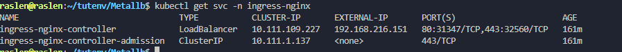
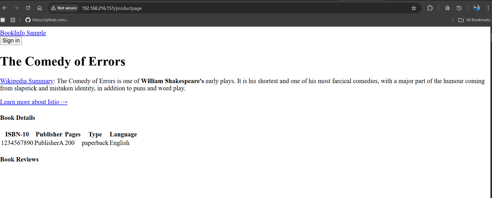

# 🚀 Guide Complet : Exposition d'Application avec Nginx Ingress et MetalLB (Labo Local)


__Pré-requis__

- Un cluster Kubernetes fonctionnel (ex: kubeadm, Kind, Minikube).  
Votre application (ici, Bookinfo) déjà déployée et ses services ClusterIP fonctionnels dans le namespace default.    

``````
MetalLB est déjà installé et configuré sur votre cluster. Si ce n'est pas le cas, référez-vous à mon guide pas à pas disponible dans ~/tutenv/Metallb/config.md pour l'installation et la définition du pool d'adresses IP.

``````


__1- Exécuter la commande d'installation__ 🛠️

`````
kubectl apply -f https://raw.githubusercontent.com/kubernetes/ingress-nginx/controller-v1.10.0/deploy/static/provider/baremetal/deploy.yaml
``````

Cette commande va créer un nouveau namespace ingress-nginx et y déployer le contrôleur.  

Tu verras des messages created pour les différents objets Kubernetes (Namespace, ServiceAccount, Role, ClusterRole, ConfigMap, Deployment, Service, etc.).


**2- Vérifier le déploiement de l'Ingress Controller :** ✅

```````
kubectl get pods -n ingress-nginx -w
```````

**Étape 2 : Convertir le Service Nginx Ingress en LoadBalancer** 🔄 

Le manifest par défaut Nginx utilise NodePort en environnement bare-metal. Nous allons le "patcher" pour qu'il soit de type LoadBalancer et obtienne une adresse IP stable de MetalLB.

``````
kubectl patch svc ingress-nginx-controller -n ingress-nginx -p '{"spec": {"type": "LoadBalancer"}}'
``````
__Vérifiez l'adresse IP externe allouée par MetalLB :__

``````
kubectl get svc -n ingress-nginx -w
``````



** Étape 4 : Création de l'objet Ingress pour Bookinfo **  🗺️


__Créer un nouveau fichier YAML :__

````
mkdir -p ~/tutenv/ingress/
vi ~/tutenv/ingress/bookinfo-ingress.yaml`
`````


Colle le contenu suivant dans ce fichier 

```````
apiVersion: networking.k8s.io/v1
kind: Ingress
metadata:
  name: bookinfo-ingress
  namespace: default
spec:

  ingressClassName: nginx 
  rules:
  - http:
      paths:
      - path: /productpage
        pathType: Prefix
        backend:
          service:
            name: productpage
            port:
              number: 9080

```````

__Étape 5 : Appliquer l'objet Ingress au cluster__ ✨

**Appliquer le fichier YAML :**

`````
kubectl apply -f ~/tutenv/ingress/bookinfo-ingress.yaml
`````

__Vérifier que l'Ingress a été créé et reconnu par le Controller :__

``````
kubectl get ingress -n default
``````
__Étape 4 : Accéder à Votre Application ! 🌐__
Tout est configuré ! Accédez à votre application en utilisant l'IP du LoadBalancer de votre Nginx Ingress Controller.

Rappelez l'EXTERNAL-IP de votre ingress-nginx-controller notée à l'Étape 2 (par exemple : 192.168.216.151).
Construisez l'URL d'accès complète :
````
http://<EXTERNAL-IP-Nginx-Controller>/<chemin-de-ton-ingress>`
````
Exemple avec vos valeurs :
http://192.168.216.151/productpage
Ouvrez cette URL dans votre navigateur ! 🥳`

Vous devriez voir la page frontend de votre application Bookinfo s'afficher, cette fois-ci via une IP de LoadBalancer stable !


