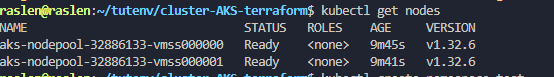

# 🚀 Guide Complet : Exposer une Application Kubernetes sur Azure AKS avec Nginx Ingress Controller et un Vrai Nom de Domaine Public


__Contexte de départ__


**Vous avez un répertoire ~/tutenv/cluster-AKS-terraform contenant votre configuration Terraform pour AKS (main.tf, outputs.tf).**
```
cd ~/tutenv/cluster-AKS-terraform
terraform init 
terraform plan 
terraform apply --auto-approve
az aks get-credentials --resource-group rg-raslen-cert --name raslen-cert-aks
```
Vous venez de créer votre cluster AKS en utilisant Terraform.
Votre kubectl est configuré pour interagir avec ce cluster AKS.




**Votre application "Online Boutique Frontend" est prête à être déployée,**
````
kubectl create ns  test
cd ~/tutenv/app-de-test-2/manifests
kubectl apply -f angular-app-deployment.yaml
kubectl apply -f angular-app-service.yaml  

````


