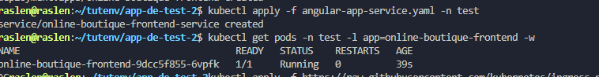
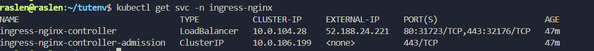
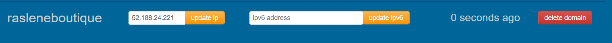
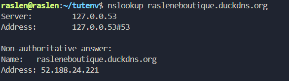
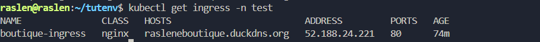
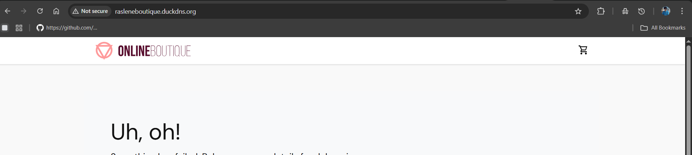

# 🚀 Guide Complet : Exposer une Application Kubernetes sur Azure AKS avec Nginx Ingress Controller et un Vrai Nom de Domaine Public


__Contexte de départ__


**Vous avez un répertoire ~/tutenv/cluster-AKS-terraform contenant votre configuration Terraform pour AKS (main.tf, outputs.tf).** ✨🧐
```
cd ~/tutenv/cluster-AKS-terraform
terraform init 
terraform plan 
terraform apply --auto-approve
az aks get-credentials --resource-group rg-raslen-cert --name raslen-cert-aks
```
Vous venez de créer votre cluster AKS en utilisant Terraform.
Votre kubectl est configuré pour interagir avec ce cluster AKS.


**Votre application "Online Boutique Frontend" est prête à être déployée,**
````
kubectl create ns  test
cd ~/tutenv/app-de-test-2/manifests  
kubectl apply -f angular-app-deployment.yaml -n test 
kubectl apply -f angular-app-service.yaml -n test
kubectl get pods -n test -l app=online-boutique-frontend 
kubectl get svc -n test online-boutique-frontend-service
````



# Étape 2 : Installer le Nginx Ingress Controller sur AKS 🌐

__Installer le Nginx Ingress Controller (manifest cloud)__  
````
kubectl apply -f https://raw.githubusercontent.com/kubernetes/ingress-nginx/controller-v1.10.0/deploy/static/provider/cloud/deploy.yaml 
````
__Vérifier le déploiement de l'Ingress Controller : 🧐__  
````
kubectl get pods -n ingress-nginx -w

kubectl get svc -n ingress-nginx -w
````



# Étape 3 : Configurer le Nom de Domaine Public (DNS) 🗺️

Associez votre nom de domaine réel à l'IP publique de votre Ingress Controller.

__Obtenir un nom de domaine (si ce n'est pas déjà fait) : ✨__  

__Méthode Gratuite (recommandée) :__ Utilisez DuckDNS (www.duckdns.org).

Créez un compte et un sous-domaine (ex: __rasleneboutique.duckdns.org__).

__Mettre à jour l'enregistrement DNS A sur DuckDNS : 📝__  
Connectez-vous à DuckDNS.org.  
Localisez votre domaine (ex: rasleneboutique.duckdns.org).  
Remplacez l'IP affichée par la nouvelle IP publique de votre Ingress Controller : 52.188.24.221.  
Cliquez sur "update ip".  





__Vérifier la propagation DNS : ⏳__  

````
nslookup rasleneboutique.duckdns.org
````



 # Etape 4 : Configurer le Network Security Group (NSG) Azure 🔥
__Rappel Important !!! :__ 

Pour qu'un site web public soit accessible sur AKS, il est impératif d'autoriser le trafic entrant sur les ports 80 (HTTP) et 443 (HTTPS) dans le Network Security Group (NSG) associé aux nœuds de votre cluster AKS.

__Récupérer le nom du Groupe de ressources des nœuds AKS :__

````
NODE_RG_NAME=$(az aks show --resource-group rg-raslen-cert --name raslen-cert-aks --query nodeResourceGroup -o tsv)
echo "Le groupe de ressources des nœuds est : $NODE_RG_NAME"
````

__Lister le nom du NSG dans ce groupe de ressources : 📋__  
````
NSG_NAME=$(az network nsg list --resource-group $NODE_RG_NAME --query "[0].name" -o tsv)
echo "Le nom du NSG est : $NSG_NAME"
````

__Ajouter les règles de sécurité pour les ports 80 et 443 : ✅__

````
# Règle pour HTTP (port 80)
az network nsg rule create \
  --resource-group $NODE_RG_NAME \
  --nsg-name $NSG_NAME \
  --name AllowHTTPInbound \
  --priority 1000 \
  --direction Inbound --access Allow --protocol Tcp \
  --source-address-prefixes Internet --destination-port-ranges 80 \
  --description "Allow inbound HTTP traffic to AKS Ingress" 

# Règle pour HTTPS (port 443)
az network nsg rule create \
  --resource-group $NODE_RG_NAME \
  --nsg-name $NSG_NAME \
  --name AllowHTTPSInbound \
  --priority 1001 \
  --direction Inbound --access Allow --protocol Tcp \
  --source-address-prefixes Internet --destination-port-ranges 443 \
  --description "Allow inbound HTTPS traffic to AKS Ingress" 
````

# Étape 5 : Créer l'Objet Ingress pour l'Application (Test HTTP) 🕸️

Assure-toi d'être dans le répertoire de ton application (ex: ~/tutenv/app-de-test-2).  
Remplace rasleneboutique.duckdns.org par ton nom de domaine exact.  


````
cd ~/tutenv/app-de-test-2
vi boutique-ingress-prod-azure.yaml
````

__Colle le contenu suivant dans ce fichier :__  

````
apiVersion: networking.k8s.io/v1
kind: Ingress
metadata:
  name: boutique-ingress
  namespace: test 
spec:
  ingressClassName: nginx 
  rules:
  - host: rasleneboutique.duckdns.org 
    http:
      paths:
      - path: / 
        pathType: Prefix
        backend:
          service:
            name: online-boutique-frontend-service 
            port:
              number: 80 

 ````

__Appliquer le nouvel Ingress : ✨__             

````
kubectl apply -f boutique-ingress-prod-azure.yaml -n test
````

__Vérifier que le nouvel Ingress est listé et a bien une IP : 📋__

````
kubectl get ingress -n test -w
````




__Forcer le rechargement de l'Ingress Controller (juste au cas où) : ♻️__

````
kubectl delete pod -n ingress-nginx -l app.kubernetes.io/component=controller
# Laissez le nouveau pod démarrer.
````

__Maintenant, tu devrais pouvoir tester l'accès à l'application via HTTP :!!!!!__

````
http://rasleneboutique.duckdns.org/
````

