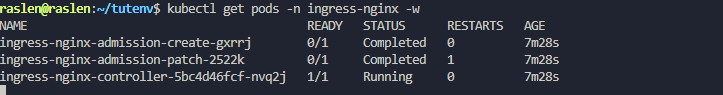

#  Guide Complet : Installation Nginx Ingress Controller et Exposition d'Application

__Exécuter la commande d'installation__

`````
kubectl apply -f https://raw.githubusercontent.com/kubernetes/ingress-nginx/controller-v1.10.0/deploy/static/provider/baremetal/deploy.yaml
``````

Cette commande va créer un nouveau namespace ingress-nginx et y déployer le contrôleur.  

Tu verras des messages created pour les différents objets Kubernetes (Namespace, ServiceAccount, Role, ClusterRole, ConfigMap, Deployment, Service, etc.).

**Vérifier le déploiement de l'Ingress Controller :**

```````
kubectl get pods -n ingress-nginx -w
```````


La commande -w (watch) te permettra de voir l'évolution en temps réel.  

Tu devrais voir des pods comme ingress-nginx-admission-create-XXXXX et ingress-nginx-admission-patch-XXXXX passer en Completed (ce sont des jobs de configuration qui s'exécutent une fois).  

Le plus important est le pod ingress-nginx-controller-XXXXX. Il doit être en Running et READY 1/1.  



