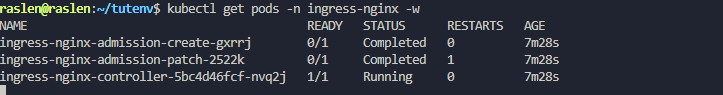
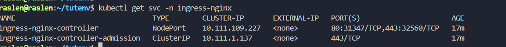
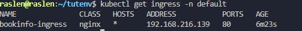

#  Guide Complet : Installation Nginx Ingress Controller et Exposition d'Application

__1- Exécuter la commande d'installation__

`````
kubectl apply -f https://raw.githubusercontent.com/kubernetes/ingress-nginx/controller-v1.10.0/deploy/static/provider/baremetal/deploy.yaml
``````

Cette commande va créer un nouveau namespace ingress-nginx et y déployer le contrôleur.  

Tu verras des messages created pour les différents objets Kubernetes (Namespace, ServiceAccount, Role, ClusterRole, ConfigMap, Deployment, Service, etc.).


**2- Vérifier le déploiement de l'Ingress Controller :**

```````
kubectl get pods -n ingress-nginx -w
```````


La commande -w (watch) te permettra de voir l'évolution en temps réel.  

Tu devrais voir des pods comme ingress-nginx-admission-create-XXXXX et ingress-nginx-admission-patch-XXXXX passer en Completed (ce sont des jobs de configuration qui s'exécutent une fois).  

Le plus important est le pod ingress-nginx-controller-XXXXX. Il doit être en Running et READY 1/1.  





** 3- Vérifier le Service d'exposition de l'Ingress Controller : **
````
kubectl get svc -n ingress-nginx`
`````

Tu devrais voir un service nommé ingress-nginx-controller.
Note bien son TYPE (probablement NodePort) et ses PORT(S). Par exemple : 80:32331/TCP,443:31913/TCP.





** Étape 3 : Création de l'objet Ingress pour Bookinfo **


__Créer un nouveau fichier YAML :__

````
mkdir -p ~/tutenv/ingress/
vi ~/tutenv/ingress/bookinfo-ingress.yaml`
`````


Colle le contenu suivant dans ce fichier 

```````
apiVersion: networking.k8s.io/v1
kind: Ingress
metadata:
  name: bookinfo-ingress
  namespace: default
spec:

  ingressClassName: nginx 
  rules:
  - http:
      paths:
      - path: /productpage
        pathType: Prefix
        backend:
          service:
            name: productpage
            port:
              number: 9080

```````

__Étape 4 : Appliquer l'objet Ingress au cluster__

**Appliquer le fichier YAML :**

`````
kubectl apply -f ~/tutenv/ingress/bookinfo-ingress.yaml
`````

__Vérifier que l'Ingress a été créé et reconnu par le Controller :__

``````
kubectl get ingress -n default
``````




**Récupérer l'adresse IP de ton nœud Kubernetes :**  

C'est l'adresse IP de la machine physique ou virtuelle (le control plane où est déployé l'Ingress Controller).
````
hostname -I | awk '{print $1}'`
`````

Note cette IP. 

**Construire l'URL d'accès complète :**  
L'URL sera de la forme :
``````
http://<IP-de-ton-node>:<NodePort-Nginx>/<chemin-de-ton-ingress>
``````

par exemple 

`````
http://192.168.216.141:31347/productpage
``````